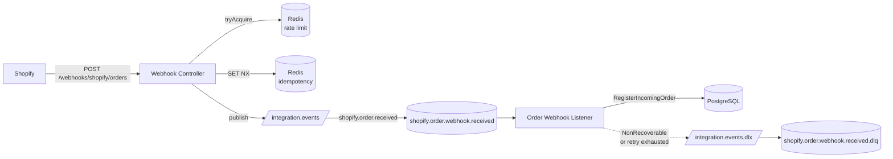

# Integration Hub Service

[](https://github.com/williamfds/integration-hub-service/actions/workflows/ci.yml)
[](https://openjdk.org/projects/jdk/21/)
[](https://spring.io/projects/spring-boot)

Recebe webhooks de plataformas de e-commerce, aplica idempotência e
rate limit, e processa de forma assíncrona via RabbitMQ. Normaliza para
um modelo canônico interno e expõe API REST de pedidos.

## Breaking change (Semana 2)

`POST /webhooks/shopify/orders` agora **não devolve mais o pedido
canônico no corpo**. Devolve `202 Accepted` com:

```json
{ "webhookId": "demo-1", "status": "received" }
```

O pedido só existe depois que o consumer processa a mensagem.
Use `GET /orders/{id}` ou `GET /orders?platform=SHOPIFY` para consultar.

## Arquitetura



Hexagonal pragmática. Redis, RabbitMQ e JPA vivem em `infrastructure/*`.
Domínio segue limpo — só ganhou `RecoverableException` /
`NonRecoverableException` para sinalizar intenção pro listener.

## Rodar localmente

```bash
docker compose up -d
./mvnw spring-boot:run
```

- API:        `http://localhost:8080`
- Swagger UI: `http://localhost:8080/swagger-ui.html`
- RabbitMQ:   `http://localhost:15672` (guest / guest)
- Actuator:   `http://localhost:8080/actuator/health`

## Idempotência

Cada webhook precisa enviar header `X-Webhook-Id`. Ausência → 400.

A chave `webhook:shopify:order:{webhookId}` é gravada no Redis via
`SET NX` com TTL de 24h. Reentrega no mesmo `X-Webhook-Id` recebe 202
com `{"status": "duplicate"}` e nada é publicado.

Trade-off: existe uma janela entre `SET NX` e o publish no Rabbit em
que um crash do processo deixa o webhook "claimado" sem trabalho
emitido. Replay da plataforma vê duplicata e descarta — perdemos o
evento. **TODO (Semana 3):** outbox pattern para fechar essa janela.

Detalhe completo em [ADR-005](docs/adr/ADR-005-idempotency-strategy.md).

## Retry e DLQ

Retry vive no `SimpleRabbitListenerContainerFactory`:

- Backoff exponencial: 1s → 2s → 4s → 8s → ... (max 30s).
- Até 5 tentativas (configurável em `application.yml`).
- Esgotou → `RejectAndDontRequeueRecoverer` → DLX → DLQ.

Erros definitivos (payload Shopify malformado, `total_price` não
numérico) viram `NonRecoverableException` no listener, que é
convertida em `AmqpRejectAndDontRequeueException` e vai direto pra
DLQ sem retry.

Detalhes em [ADR-006](docs/adr/ADR-006-retry-strategy.md) e
[ADR-007](docs/adr/ADR-007-dlq-strategy.md).

## Testar

### Caminho feliz

```bash
curl -X POST http://localhost:8080/webhooks/shopify/orders \
  -H "Content-Type: application/json" \
  -H "X-Webhook-Id: demo-1" \
  -d @docs/examples/shopify-order-created.json

curl http://localhost:8080/orders?platform=SHOPIFY
```

### Webhook duplicado

```bash
# Primeira: status=received
curl -X POST http://localhost:8080/webhooks/shopify/orders \
  -H "X-Webhook-Id: dup-1" -H "Content-Type: application/json" \
  -d @docs/examples/shopify-order-created.json

# Segunda com mesmo header: status=duplicate
curl -X POST http://localhost:8080/webhooks/shopify/orders \
  -H "X-Webhook-Id: dup-1" -H "Content-Type: application/json" \
  -d @docs/examples/shopify-order-created.json
```

### Observar fila e DLQ

Management UI em `http://localhost:15672` → Queues → ver
`shopify.order.webhook.received` (consumida) e
`shopify.order.webhook.received.dlq` (mensagens que falharam).

`./mvnw verify` roda 9 testes (unit + integração) com Testcontainers
para Postgres, Redis e RabbitMQ.

## Decisões registradas

- [ADR-001](docs/adr/ADR-001-build-tool.md) — Maven
- [ADR-002](docs/adr/ADR-002-migration-tool.md) — Flyway
- [ADR-003](docs/adr/ADR-003-webhook-response-code.md) — 202 Accepted
- [ADR-004](docs/adr/ADR-004-async-webhook-processing.md) — fluxo async
- [ADR-005](docs/adr/ADR-005-idempotency-strategy.md) — Redis SET NX
- [ADR-006](docs/adr/ADR-006-retry-strategy.md) — retry na borda AMQP
- [ADR-007](docs/adr/ADR-007-dlq-strategy.md) — DLQ + plano de replay

## Limitações da Semana 2

- Sem validação HMAC do `X-Shopify-Hmac-Sha256`.
- Sem outbox: janela curta entre `SET NX` e publish.
- Sem replay automatizado da DLQ — só via Management UI.
- Rate limit por contador fixo (não Lua atômico) — race teórica em
  altíssima concorrência.
- Sem appender JSON nem métricas Prometheus.

## Próximos passos (Semana 3)

- Validação HMAC real do header `X-Shopify-Hmac-Sha256`.
- Outbox pattern para at-least-once entre Redis e Rabbit.
- Replay tool para DLQ.
- Métricas Prometheus + appender Logback JSON.
- Conector Nuvemshop reusando topology e idempotência.
